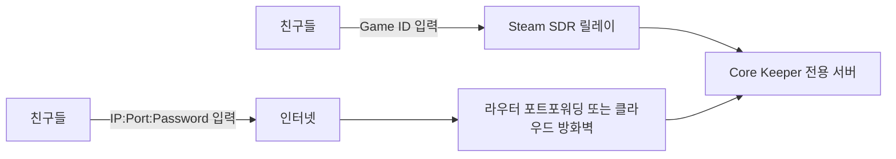

# Core Keeper 전용 서버와 상시 호스팅 구축 가이드

## Executive Summary

Core Keeper는 **공식 전용 서버를 지원**합니다. 스팀 스토어 페이지는 “host your own dedicated server”를 명시하고 있고, 개발사/퍼블리셔 공지는 2022년 dedicated server support 도입을 공식 발표했으며, 현재는 **Core Keeper Dedicated Server**라는 별도 Steam Tool 앱이 존재합니다. SteamDB 기준 이 전용 서버 앱은 **App ID 1963720**, **Windows/Linux 지원**, **Tool 타입**, **FreeToDownload**로 표시됩니다. 즉, “내가 접속해야만 열리는 세션” 대신, **별도 상시 실행 프로세스**로 월드를 열어 둘 수 있습니다. citeturn5view3turn4search0turn5view4

실무적으로는 선택지가 세 갈래입니다. **Steam 친구만 접속**하면 되는 비공개 서버라면 **SDR 기반 Game ID 방식**이 가장 쉽고 안전합니다. 이 모드는 Steam Datagram Relay를 사용해 **서버 실 IP를 숨기고**, 포트포워딩 없이도 동작할 수 있어 가정집 환경이나 한국 ISP 회선에서 가장 스트레스가 적습니다. 반대로 **Steam 외 PC 플랫폼과의 직접 접속** 또는 **IP:Port 기반 접속**이 필요하면, 현재 Core Keeper는 **Direct Connection**도 지원하므로 IP, Port, Password 방식으로 접속할 수 있지만, 이 경우 방화벽과 포트 개방이 필요합니다. citeturn13search1turn28search0turn21view0

구축 난이도와 운영 안정성까지 고려하면, 가장 추천되는 구성은 다음과 같습니다. **초보자**는 오래된 Windows PC나 미니 PC에 전용 서버를 띄우고 **SDR(Game ID)** 로 운영하는 방식이 가장 쉽습니다. **비용 최적화**는 이미 켜져 있는 집 NAS/x86 미니 PC의 Docker 운영이 유리하고, 클라우드만 쓸 경우에는 예측 가능한 정액형인 Lightsail/DigitalOcean이 다루기 쉽습니다. **성능 최적화**는 Ubuntu 기반 x86 VPS 또는 별도 홈서버에 systemd 자동재시작과 정기 백업을 붙이는 구성이 가장 안정적입니다. citeturn7view1turn21view0turn15search0turn36search0

## 공식 지원 여부와 가장 중요한 결론

Core Keeper의 멀티플레이 기본 동작은 원래 “플레이어가 호스트가 되는” 방식이었지만, 개발사는 2022년 dedicated server support를 공식 발표하면서 “호스트가 온라인이 아니어도 접속 가능한 월드”를 제공하겠다고 명시했습니다. 스팀 스토어 본문에도 전용 서버 호스팅 문구가 포함되어 있고, 공식 지원 스레드에서는 Steam 라이브러리의 **Tools** 항목에서 **Core Keeper Dedicated Server**를 설치하는 절차를 안내하고 있습니다. citeturn4search0turn19view0turn7view3

현재 확인되는 전용 서버 앱은 **Core Keeper Dedicated Server (App 1963720)** 이며, SteamDB는 이를 **Tool**, **Windows/Linux 지원**, **FreeToDownload** 로 표시합니다. 이 조합은 “게임 클라이언트를 계속 켜 두는 임시 호스트”가 아니라, 별도 서버 바이너리를 장기 실행하는 형태가 가능하다는 뜻입니다. citeturn5view4turn34search1

또 하나 중요한 변화는 **직접 접속의 공식 개선**입니다. 2025년 1.1.2.3 패치 노트에는 “All PC platforms now support joining and playing in Steam dedicated servers using direct connections”와 함께, **서버 IP, Port, Password** 로 전용 서버에 접속할 수 있다고 적혀 있습니다. 같은 패치에서 **짧은 Game ID 허용**과 **플랫폼 제한 설정**도 추가되었습니다. 따라서 지금 시점의 Core Keeper는 다음 두 방식이 모두 가능합니다. 하나는 **Steam Game ID 기반 접속**, 다른 하나는 **IP:Port:Password 기반 Direct Connect** 입니다. citeturn13search1turn13search6

공식 고객지원 FAQ를 함께 보면, PC 플랫폼 간 멀티플레이는 기본적으로 **Game ID** 를 통해 접속하고, 서로 다른 PC 스토어 간 플레이 시에는 **cross-play 옵션**을 켜라고 안내합니다. 이 점을 현재 패치 노트와 합치면, 실무 결론은 명확합니다. **Steam 친구들만 모이는 사설 서버**라면 SDR/Game ID 방식이 가장 단순하고, **스토어가 다른 친구가 섞이거나 직접 IP 접속이 필요한 경우**에는 Direct Connect 모드가 맞습니다. citeturn5view2turn13search1

다음 다이어그램처럼 이해하면 됩니다.



SDR 모드는 Valve의 Steam Datagram Relay를 쓰기 때문에 **IP 비노출**, **인증/암호화/속도 제한**, **NAT 우회 이점**이 있고, 커뮤니티 Docker 문서도 이 모드에서는 **공유기/방화벽 포트 개방이 필요 없다고** 설명합니다. 반대로 Direct Connect는 더 직접적인 경로를 쓸 수 있지만, **서버가 인터넷에서 도달 가능해야 하고** 라우터/방화벽 포트를 열어야 합니다. citeturn28search0turn21view0

핵심 결론만 짧게 말하면 이렇습니다. **“내가 접속하지 않아도 친구들이 언제든 접속 가능한 Core Keeper 월드”는 공식 전용 서버 기능으로 구축 가능**하고, 현재는 **집 PC, NAS, Linux 서버, 클라우드 VPS** 중 원하는 환경에 올릴 수 있습니다. 다만 **Steam-only 비공개 서버**인지, **직접 IP/크로스플레이**가 필요한지에 따라 최적 설계가 달라집니다. citeturn4search0turn13search1turn21view0

## 호스팅 방식별 구축 절차

아래 비교는 공식/원문 문서와 한국어 실사용 가이드를 함께 본 결과입니다. 요약하면 **Windows는 가장 쉬움**, **Linux는 가장 안정적**, **Docker/NAS는 관리 편의성 높음**, **VPS는 24시간 가동·외부 접근성에 최적**입니다. Synology/QNAP NAS는 사실상 “Docker 호스트”로 보는 것이 맞고, 클라우드 VPS는 설치 절차 자체는 Linux와 거의 같습니다. citeturn7view3turn33view2turn21view0turn27search0turn27search3

| 옵션 | 장점 | 단점 | 추천 상황 |
|---|---|---|---|
| Windows PC | 가장 쉬운 설치, Steam Tools 사용 가능 | GUI 기반이라 자동화·무인 운영이 다소 불편 | 남는 집 PC, 초보자 |
| Linux PC | systemd 자동시작/재시작, SSH 원격관리 쉬움 | 초반 CLI 진입장벽 | 미니 PC, 홈서버, VPS |
| Docker | 배포/업데이트/볼륨관리 쉬움 | 공식 이미지가 아니라 커뮤니티 이미지 의존 | NAS, 리눅스 숙련자 |
| Synology/QNAP NAS | 이미 24시간 켜져 있음, 저전력 | ARM 모델 호환성/성능 편차 | NAS가 이미 있고 Docker 가능 |
| AWS/DO/Lightsail/Oracle/GCP | 외부 접속성, 상시 가동, 집 회선 문제 없음 | 월 비용 또는 클라우드 콘솔 학습 필요 | 24시간 가동 최우선 |
| SDR(Game ID) | 포트포워딩 불필요, IP 숨김 | 사실상 Steam 중심 사용에 적합 | 친구끼리 비공개 서버 |
| Direct Connect | IP/Port/Password 직접 접속 | 포트 개방·공인 IP 필요 | 크로스플레이, 직접 접속 선호 |

### Windows PC

가장 쉬운 공식 경로는 Steam 라이브러리의 **Tools** 에서 **Core Keeper Dedicated Server** 를 설치해 실행하는 것입니다. 공식 지원 스레드는 설치 후 “Launch Dedicated Server”를 실행하면 콘솔 창이 뜨고, 잠시 후 **Game ID** 가 생성되며, 이 상태로 창을 닫지 않고 유지하면 서버가 살아 있다고 안내합니다. 종료는 콘솔에서 **`q`** 를 눌러 정상 종료하는 방식입니다. citeturn7view3

Windows에서 자동화와 재부팅 후 자동 시작까지 고려하면, 실제 운영은 Steam GUI보다 **SteamCMD 기반 별도 서버 폴더**가 더 편합니다. SteamCMD 자체는 Valve가 anonymous 로그인과 `app_update` 방식으로 전용 서버를 내려받는 표준 클라이언트라고 설명하고 있고, Core Keeper 커뮤니티/가이드에서는 `app_update 1963720 validate` 로 서버를 설치·업데이트하는 방법이 널리 쓰입니다. citeturn8search0turn33view2turn34search9

다음은 가장 무난한 Windows 설치 예시입니다.

```powershell
# 관리자 PowerShell 또는 SteamCMD 콘솔에서 실행 예시
# 서버 파일을 C:\CoreKeeperServer 에 설치

force_install_dir C:\CoreKeeperServer
login anonymous
app_update 1963720 validate
quit
```

설치가 끝나면 보통 서버 폴더 안의 `Launch.bat` 를 실행해 첫 부팅을 합니다. 첫 실행 후에는 사용자 프로필 아래에 `DedicatedServer` 저장 경로와 `ServerConfig.json` 이 생성됩니다. 공식/커뮤니티 자료를 종합하면 Windows 전용 서버 저장 루트는 `%USERPROFILE%\AppData\LocalLow\Pugstorm\Core Keeper\DedicatedServer` 이고, 실제 월드 파일은 그 아래 `worlds` 폴더에 위치합니다. citeturn23view0turn24view0turn33view2

Windows 자동 시작은 작업 스케줄러(Task Scheduler)로 처리하는 것이 가장 무난합니다. Microsoft 문서는 `schtasks /create` 의 `ONSTART` 트리거가 **부팅 시 실행**을 뜻한다고 설명합니다. 따라서 아래처럼 래퍼 배치 파일을 하나 만들고, 부팅 시 실행되는 예약 작업으로 등록하면 됩니다. citeturn25search0turn25search4

```bat
:: C:\CoreKeeperServer\LaunchServer.bat
@echo off
REM Core Keeper 전용 서버 실행용 래퍼
REM 기본은 SDR(Game ID) 모드
cd /d C:\CoreKeeperServer
call Launch.bat

REM Direct Connect를 꼭 쓸 경우에는,
REM 서버 README/커뮤니티 가이드 기준으로 실행 명령 뒤에
REM -ip 0.0.0.0 -port 27015 같은 인자를 붙이는 방식을 고려
REM 단, 현재 공식 README 전문은 웹에서 직접 확인이 어려워
REM 운영 전 테스트가 필요함
```

```powershell
# 관리자 권한 CMD/PowerShell
schtasks /Create /TN "CoreKeeperServer" /SC ONSTART /TR "C:\CoreKeeperServer\LaunchServer.bat" /RU SYSTEM
```

가정집 Windows 호스트에서 **Direct Connect** 를 쓸 경우에는 Windows 방화벽 인바운드 규칙도 열어야 합니다. Microsoft의 `New-NetFirewallRule` 문서와 Windows Firewall CLI 가이드는 PowerShell 및 명령줄로 인바운드 규칙을 만들 수 있음을 설명합니다. Core Keeper의 초기 공식 dedicated server 안내는 기본 포트로 **UDP 27015-27016** 을 제시합니다. 실무적으로는 이 범위를 여는 것이 가장 안전합니다. citeturn25search1turn25search5turn12view0

```powershell
# 관리자 PowerShell
# Direct Connect를 쓸 때만 필요
New-NetFirewallRule `
  -DisplayName "Core Keeper Dedicated Server UDP" `
  -Direction Inbound `
  -Protocol UDP `
  -LocalPort 27015-27016 `
  -Action Allow
```

### Linux PC와 VPS

Linux는 **24시간 운영용으로 가장 추천되는 방식**입니다. 이유는 간단합니다. SteamCMD 설치가 쉽고, `systemd` 로 부팅 후 자동 시작·죽으면 재시작·로그 관리까지 한 번에 해결되기 때문입니다. Core Keeper Linux 가이드는 `steamcmd +login anonymous +app_update 1963720 +quit` 계열 설치가 가능하다고 적고 있고, 실제 운영에서는 `_launch.sh` 를 systemd 서비스로 감싸는 것이 안정적이라는 경험담이 반복됩니다. citeturn33view0turn7view1

Ubuntu 22.04 계열을 기준으로 한 가장 보편적인 절차는 다음과 같습니다. 한국어 커뮤니티 가이드와 해외 가이드 모두 `steamcmd` 설치 전에 `multiverse`/i386 환경을 준비한 뒤, anonymous 로그인으로 전용 서버를 받는 흐름을 사용합니다. citeturn35view2turn33view1turn8search0

```bash
# Ubuntu 계열 예시
# 한국어 주석 포함

sudo apt update
sudo add-apt-repository multiverse -y
sudo dpkg --add-architecture i386
sudo apt update
sudo apt install -y steamcmd

# 서버 전용 계정 예시
sudo useradd -m -s /bin/bash steam || true
sudo mkdir -p /home/steam/core-keeper-server
sudo chown -R steam:steam /home/steam/core-keeper-server

# 서버 파일 설치
sudo -u steam steamcmd \
  +force_install_dir /home/steam/core-keeper-server \
  +login anonymous \
  +app_update 1963720 validate \
  +quit
```

처음 한 번은 직접 실행해서 설정 파일과 월드 경로를 생성하는 편이 좋습니다. 커뮤니티 문서에서는 `_launch.sh` 가 제공되고, 설정 파일은 Linux 전용 서버 기준 `~/.config/unity3d/Pugstorm/Core Keeper/DedicatedServer` 아래 생성된다고 정리합니다. citeturn33view0turn23view2

```bash
# 첫 실행
sudo -u steam bash /home/steam/core-keeper-server/_launch.sh
```

그다음부터는 systemd 서비스로 고정하는 것을 권장합니다. 리눅스 일반론으로도 systemd는 서비스를 감독·재시작하는 표준 도구이고, Core Keeper 커뮤니티 가이드는 실제로 systemd 서비스 파일 예시를 제공하며 `Restart=always` 와 `systemctl enable` 로 자동시작을 구성합니다. citeturn25search3turn7view1

```ini
# /etc/systemd/system/corekeeper.service
[Unit]
Description=Core Keeper Dedicated Server
After=network-online.target
Wants=network-online.target

[Service]
Type=simple
User=steam
Group=steam
WorkingDirectory=/home/steam/core-keeper-server
ExecStart=/bin/bash /home/steam/core-keeper-server/_launch.sh
Restart=always
RestartSec=5

[Install]
WantedBy=multi-user.target
```

```bash
sudo systemctl daemon-reload
sudo systemctl enable --now corekeeper.service
sudo systemctl status corekeeper.service
```

Linux에서 **Direct Connect** 를 쓰려면 OS 방화벽과 공유기/VPS 방화벽도 같이 열어야 합니다. Ubuntu 공식 문서는 `ufw` 가 기본적인 호스트 방화벽 도구라고 설명합니다. Core Keeper 기본 포트는 공식 공지 기준 **UDP 27015-27016** 이므로, 이 범위를 허용하는 쪽이 보수적으로 안전합니다. 단, 현재 Direct Connect는 포트 지정 기반으로 더 세밀하게 쓸 수 있으므로, 실제 지정 포트만 여는 것이 더 바람직합니다. citeturn26search3turn12view0turn12view1

```bash
# UFW 예시
sudo ufw allow 27015:27016/udp
sudo ufw enable
sudo ufw status verbose
```

Linux 운영에서 자주 맞닥뜨리는 예외 중 하나는 `steamclient.so: wrong ELF class: ELFCLASS32` 입니다. 커뮤니티 가이드는 이 경우 `~/.steam/sdk64/steamclient.so` 에 64비트 `steamclient.so` 를 심볼릭 링크하는 방식이 통하는 사례를 제시합니다. 공식 해결책이라고 보기는 어렵지만, 실제로 많이 보고되는 대표 이슈입니다. citeturn33view0

```bash
mkdir -p ~/.steam/sdk64
ln -s ~/.steam/steamcmd/linux64/steamclient.so ~/.steam/sdk64/steamclient.so
```

### Docker와 NAS

Docker는 **배포 재현성**, **서버 데이터/실행 파일 분리**, **업데이트 편의성** 때문에 집 PC, 리눅스 서버, NAS 어디에서나 유용합니다. 다만 현재 제가 확인한 범위에서 **Core Keeper 공식 Docker 이미지**는 찾지 못했고, 널리 쓰이는 방식은 `escaping/core-keeper-dedicated` 커뮤니티 이미지를 사용하는 것입니다. 이 이미지는 `server-data` 와 `server-files` 볼륨 분리, `WORLD_NAME`, `MAX_PLAYERS`, `SERVER_PORT`, `PASSWORD` 같은 환경 변수, `GameID.txt` 생성, ARM 장치용 Box64 변형까지 문서화하고 있습니다. citeturn21view0turn21view1

가장 기본적인 **SDR(Game ID)** 중심 Docker Compose 예시는 아래처럼 잡으면 됩니다.

```yaml
# docker-compose.yml
services:
  core-keeper:
    image: escaping/core-keeper-dedicated:latest
    container_name: core-keeper-dedicated
    restart: unless-stopped
    stop_grace_period: 2m
    volumes:
      # 실행 파일 캐시
      - ./server-files:/home/steam/core-keeper-dedicated
      # 월드/설정 영속 데이터
      - ./server-data:/home/steam/core-keeper-data
    env_file:
      - ./core.env
```

```env
# core.env
# 한국어 주석 포함

WORLD_NAME=Core Keeper Server
MAX_PLAYERS=8
WORLD_INDEX=0

# SDR(Game ID)만 쓸 때는 SERVER_PORT를 비워둠
# SERVER_PORT=
# PASSWORD=
```

```bash
docker compose up -d
docker logs -f core-keeper-dedicated
docker exec -it core-keeper-dedicated cat /home/steam/core-keeper-dedicated/GameID.txt
```

**Direct Connect** 가 필요하면 `SERVER_PORT` 와 `PASSWORD` 를 주고, 포트 매핑을 추가합니다. 커뮤니티 Docker README는 `SERVER_PORT` 를 설정하면 Direct Connect 모드로 바뀐다고 명시합니다. 다만 초기 공식 Core Keeper 안내는 기본 포트 범위를 **UDP 27015-27016** 으로 설명했기 때문에, 보수적으로는 방화벽/포트포워딩에서 이 범위를 함께 고려하는 편이 안전합니다. citeturn21view1turn12view0

```yaml
services:
  core-keeper:
    image: escaping/core-keeper-dedicated:latest
    container_name: core-keeper-dedicated
    restart: unless-stopped
    stop_grace_period: 2m
    ports:
      - "27015:27015/udp"   # Direct Connect용 명시 포트
    volumes:
      - ./server-files:/home/steam/core-keeper-dedicated
      - ./server-data:/home/steam/core-keeper-data
    env_file:
      - ./core.env
```

```env
WORLD_NAME=Core Keeper Server
MAX_PLAYERS=8
WORLD_INDEX=0
SERVER_PORT=27015
PASSWORD=강한비밀번호
```

Synology와 QNAP NAS는 사실상 이 Docker 구성을 GUI로 감싸는 구조입니다. Synology **Container Manager** 는 Compose 파일 기반 **Project** 관리를 공식 지원하고, QNAP **Container Station** 역시 Docker Compose 기반 **Application** 구성을 지원합니다. 따라서 NAS에서는 위 `docker-compose.yml` 을 거의 그대로 사용하면 됩니다. citeturn27search0turn27search9turn27search3turn27search10

Synology 실무 절차는 대체로 이렇습니다. DSM 7.2+에서 Container Manager 설치 → NAS 공유 폴더 예: `/volume1/docker/corekeeper` 생성 → 그 아래 `server-files`, `server-data`, `docker-compose.yml`, `core.env` 저장 → **Project** 에서 Compose 파일 불러오기 → `경로 권한` 확인 → 시작 순서입니다. Synology 공식 문서는 Project 대시보드가 Compose 프로젝트를 관리한다고 설명하고, 별도 문서는 매핑한 폴더에 대한 권한 문제를 점검하라고 안내합니다. citeturn27search9turn27search18

QNAP도 흐름은 비슷합니다. Container Station 설치 → **Applications** 에서 Compose 앱 생성 → 공유 폴더 볼륨 연결 → 필요 시 `docker compose` 명령 사용이 가능합니다. QNAP 공식 FAQ는 최신 Container Station 3가 **Compose V2** 라서 `docker-compose` 가 아니라 `docker compose` 문법을 쓴다고 설명합니다. citeturn27search3turn27search10

아키텍처 측면에서는 **x86_64 NAS가 가장 무난**합니다. 커뮤니티 Docker 문서는 ARM 장치를 위한 Box64 변형도 제공하지만, 공식 네이티브 ARM 서버가 아니라는 점은 분명히 인식해야 합니다. 즉, **Synology/QNAP ARM 모델도 “될 수는 있지만” 호환성과 성능 면에서 x86 NAS보다 보수적으로 봐야** 합니다. citeturn21view0

### 클라우드 VPS

클라우드 VPS는 “집 인터넷”, “공유기”, “공인 IP”, “절전모드” 문제를 한 번에 없애는 가장 확실한 방법입니다. 설치 절차는 Linux와 사실상 같고, 달라지는 것은 **클라우드 콘솔에서 인바운드 방화벽을 열어야 한다는 점**뿐입니다. AWS Lightsail, Google Cloud VPC Firewall, Oracle Security List/NSG, DigitalOcean Cloud Firewall 모두 공식적으로 인바운드 규칙 추가 기능을 제공합니다. citeturn38search4turn38search5turn38search6turn38search3

실무적으로는 Ubuntu 22.04 VM 하나를 만든 뒤, 다음 순서로 가면 됩니다. SSH 키 로그인 설정 → Ubuntu 부팅 → Linux 절차대로 SteamCMD 설치 → Core Keeper Dedicated Server 설치 → systemd 등록 → 방화벽 열기 → SDR 또는 Direct Connect 선택입니다. 이때 **Steam-only 비공개 서버**면 SDR로 운영하면 되고, 별도 IP 접속이 필요할 때만 UDP 포트를 개방하면 됩니다. citeturn33view2turn21view0turn28search0

클라우드 방화벽에서 Direct Connect 쪽만 열고 싶다면, 가장 보수적인 규칙은 **UDP 27015-27016** 허용입니다. 현재 Direct Connect는 명시 포트 하나로도 운영할 수 있지만, 공식 초기 문서가 27015-27016 범위를 제시했기 때문에, 문제를 줄이려면 초기에 범위를 열고 정상 동작 확인 후 필요한 최소 포트로 줄이는 방식이 현실적입니다. citeturn12view0turn21view1

클라우드별 콘솔 포인트만 요약하면 이렇습니다.

| 클라우드 | 방화벽 포인트 | 실무 메모 |
|---|---|---|
| AWS Lightsail | 인스턴스별 IPv4/IPv6 방화벽 규칙 추가 | Direct Connect면 UDP 허용, SDR면 보통 불필요 |
| GCP | VPC Firewall Rule 생성 | `udp:27015-27016` 허용 규칙 사용 가능 |
| Oracle Cloud | Security List 또는 NSG 인그레스 규칙 | 서브넷 단위/인스턴스 그룹 단위로 제어 |
| DigitalOcean | Cloud Firewall 인바운드 규칙 추가 | UI/CLI 모두 가능, 방화벽 자체는 추가 비용 없음 |

이 표는 각 제공사의 공식 방화벽 문서를 바탕으로 정리했습니다. citeturn38search4turn38search5turn38search10turn38search3turn38search15

## 사양과 비용 비교

먼저 전제를 분명히 해야 합니다. **Core Keeper 전용 서버의 공식 최소/권장 사양 표는 별도로 공개돼 있지 않습니다.** 공식 스팀 스토어에는 클라이언트 사양만 있고, 서버 쪽은 별도 published spec이 없습니다. 그래서 아래 권장치는 **공식 클라이언트 요구사항**, **호스팅 업체의 권장치**, **커뮤니티 운영 경험**, 그리고 **서버 성능 경고 로그**를 합쳐 만든 **보수적 운영 권장치**입니다. 즉, 절대 기준이 아니라 “문제 덜 나는 권장 출발점”으로 보는 것이 맞습니다. citeturn19view0turn20search3turn20search16turn20search5

공식 스토어 기준으로 Core Keeper 자체는 Windows/Linux 64bit를 지원하고, 게임은 **1–8인** 협동을 전면에 내세웁니다. 반면 커뮤니티 설정 예시에는 `maxNumberPlayers` 가 크게 잡혀 있을 수 있지만, 이것이 곧 공식 권장 인원 수를 의미하지는 않습니다. 실제 운영 목표는 **8인 기준 안정성**으로 보는 것이 가장 현실적입니다. citeturn19view0turn19view1turn5view6

아래 표는 **모드 없음 또는 가벼운 모드**, **서버 전용 용도**, **SSD 사용**, **한국 기준 평균적인 유선 인터넷**을 전제로 한 보수적 권장치입니다. 공식 수치가 아니라 운영 가이드라인이라는 점을 전제로 보시면 됩니다. citeturn20search3turn20search16turn9search1turn20search5

| 동시 접속 | 권장 CPU | 권장 RAM | 권장 디스크 | 네트워크 권장 | 비고 |
|---|---|---:|---:|---|---|
| 1–3명 | 2 vCPU급 x86 | 4 GB | 10 GB SSD | 유선 브로드밴드 | 신선한 월드, 모드 없음 기준 |
| 4–6명 | 2 vCPU 강한 싱글코어 또는 4 vCPU 버스트 | 6 GB | 20 GB SSD | 업로드 20 Mbps+ 권장 | 오래된 월드면 RAM 여유 중요 |
| 7–8명 | 4 vCPU x86 | 8 GB | 20–30 GB SSD | 업로드 30 Mbps+ 권장 | 홈호스트보다 VPS/전용 미니PC 권장 |
| 모드 다수 | 위 표 + 1단계 상향 | 위 표 + 2 GB 이상 | 30 GB+ | 안정적 유선 필수 | 모드 의존성/로그 관리 필요 |

이 표에서 특히 중요한 것은 **CPU 성능과 안정성**입니다. 2026년 Steam 토론에는 서버가 20 updates/s 목표를 따라가지 못하면 **rubber banding, desync** 가 발생한다는 성능 경고 로그가 공유되어 있습니다. 즉, Core Keeper 서버는 RAM도 중요하지만 **“느린 코어 1개”보다는 적당히 빠른 CPU** 가 더 중요합니다. citeturn20search5

비용 측면에서는, 이미 켜져 있는 집 PC/NAS가 있다면 전기료가 사실상 핵심입니다. 한국전력 주택용 저압 요금표는 사용 구간별로 **59.1원/kWh, 122.6원/kWh, 183원/kWh …** 의 전력량 요금을 제시하고 있고, KEPCO 계산 안내는 단순 계산이 **기본요금·부가세·전력기금 등을 완전히 반영한 최종 고지서와 다를 수 있음**을 전제로 합니다. 따라서 아래는 “추가 소비전력”만 놓고 계산한 거친 예시입니다. citeturn31search3turn31search8

예를 들어 서버 운영 때문에 추가로 들어가는 전력이 평균 **10W / 20W / 40W** 라고 가정하면, 월 사용량은 각각 약 **7.2 / 14.4 / 28.8 kWh** 입니다. 이를 KEPCO 요금표의 중간 구간 단가 **122.6원/kWh** 로 단순 계산하면, 순수 전력량 요금은 대략 **883원 / 1,765원 / 3,531원** 수준입니다. 실제 청구액은 집 전체 사용량 구간, 기본요금, 부가세, 전력산업기반기금에 따라 더 올라갑니다. citeturn31search3

클라우드/VPS 예시는 아래처럼 보는 것이 현실적입니다. 이 표의 금액은 각 제공사의 공식 가격 표나 무료 프로그램 설명 기준이며, 세금·스냅샷·백업·추가 트래픽은 별도일 수 있습니다. Google Cloud는 지역별 차이가 커서 여기서는 **공식 free tier / trial 정보 위주**로 적었습니다. citeturn15search0turn15search2turn39search5turn39search13turn16search8turn16search1

| 옵션 | 예시 사양 | 월 비용 예시 | 평가 |
|---|---|---:|---|
| AWS Lightsail | 2 GB / 2 vCPU / 60 GB SSD | $10 | 1–3명, 테스트용 출발점 |
| AWS Lightsail | 4 GB / 2 vCPU / 80 GB SSD | $20 | 4–6명 운영에 무난 |
| DigitalOcean Basic | 2 GB / 1 vCPU / 50 GB | $12 | 너무 빡빡할 수 있음 |
| DigitalOcean Basic | 2 GB / 2 vCPU / 60 GB | $18 | 소규모 실사용 가능 |
| DigitalOcean Basic | 4 GB / 2 vCPU / 80 GB | $24 | 가장 무난한 클라우드 출발점 |
| Oracle Cloud Always Free | Arm Ampere A1 총 4 OCPU / 24 GB 메모리 한도 | $0 | 매우 매력적이지만 ARM·커뮤니티 Docker 전제 |
| Google Cloud Free Tier | e2-micro 1대 무료 + 90일/$300 trial | Free / credit 소진 전 | Free tier는 Core Keeper 상시 서버용으로는 너무 작음 |

정리하면, **이미 보유한 장비가 있다면 집 미니 PC/NAS가 가장 싸고**, **새로 시작한다면 4 GB급 x86 VPS가 가장 덜 피곤하며**, **최저 비용을 극단적으로 노린다면 Oracle Free Tier + Docker** 조합이 가능하지만 ARM 기반·커뮤니티 이미지라는 관리 리스크가 있습니다. citeturn39search5turn21view0turn15search0turn36search0

## 백업 복구 업데이트와 Steam 인증

백업은 생각보다 단순합니다. Core Keeper의 저장 구조에서 가장 중요한 것은 **`worlds/<index>.world.gzip`** 입니다. Core Keeper 저장소 문서는 Windows 클라이언트 저장 루트를 `%USERPROFILE%\AppData\LocalLow\Pugstorm\Core Keeper\Steam\<user-id>` 로, Windows 전용 서버 루트를 `%USERPROFILE%\AppData\LocalLow\Pugstorm\Core Keeper\DedicatedServer` 로, Linux 전용 서버 루트를 `~/.config/unity3d/Pugstorm/Core Keeper/DedicatedServer` 로 설명합니다. 또 메인 메뉴에서 **`Ctrl + Alt + B`** 를 누르면 `CoreKeeperSaves.zip` 아카이브를 데스크톱에 생성하는 백업 단축키도 제공합니다. citeturn23view0turn23view1turn23view2

현재 싱글/임시 호스트 월드를 dedicated server 로 옮길 때는, Windows 기준 클라이언트 월드 파일은 `...\Steam\<steamid>\worlds\#.world.gzip`, 전용 서버 월드는 `...\DedicatedServer\worlds\#.world.gzip` 에 두고, `ServerConfig.json` 의 `"world"` 값을 파일 번호에 맞춰야 합니다. 커뮤니티 가이드와 호스팅 문서 모두 이 방식으로 기존 월드를 서버 쪽으로 옮기라고 안내합니다. citeturn24view0turn23view3

가장 실용적인 백업 대상은 `worlds/`, `worldinfos/`, `ServerConfig.json` 입니다. 장기간 운영 서버라면 여기에 Docker 운용 시 `core.env`, `docker-compose.yml`, 그리고 필요하면 `GameID.txt` 보관도 추천할 수 있습니다. 실제 복구는 **서버 중지 → 백업 파일 덮어쓰기 → `world` 인덱스 확인 → 서버 재시작** 순서로 진행하면 됩니다. 월드 파일 번호가 2라면 `ServerConfig.json` 의 `world` 값도 2여야 합니다. citeturn23view3turn24view0turn5view6

Windows 수동 백업 스크립트 예시는 아래처럼 만들면 충분합니다.

```powershell
# backup-corekeeper.ps1
# 한국어 주석 포함

$src = "$env:USERPROFILE\AppData\LocalLow\Pugstorm\Core Keeper\DedicatedServer"
$timestamp = Get-Date -Format "yyyyMMdd-HHmmss"
$dst = "D:\Backups\CoreKeeper\$timestamp"

New-Item -ItemType Directory -Force -Path $dst | Out-Null

# 월드 파일 백업
Copy-Item "$src\worlds" -Destination $dst -Recurse -Force

# 월드 메타데이터와 설정 백업
Copy-Item "$src\worldinfos" -Destination $dst -Recurse -Force -ErrorAction SilentlyContinue
Copy-Item "$src\ServerConfig.json" -Destination $dst -Force -ErrorAction SilentlyContinue

# 필요 시 압축
Compress-Archive -Path "$dst\*" -DestinationPath "$dst.zip" -Force
```

Linux/NAS 쪽은 다음 정도로 충분합니다.

```bash
#!/usr/bin/env bash
# backup-corekeeper.sh
# 한국어 주석 포함

SRC="$HOME/.config/unity3d/Pugstorm/Core Keeper/DedicatedServer"
DST="/srv/backups/corekeeper/$(date +%F-%H%M%S)"

mkdir -p "$DST"
cp -a "$SRC/worlds" "$DST/"
cp -a "$SRC/worldinfos" "$DST/" 2>/dev/null || true
cp -a "$SRC/ServerConfig.json" "$DST/" 2>/dev/null || true

# 압축 보관
tar -C "/srv/backups/corekeeper" -czf "${DST}.tar.gz" "$(basename "$DST")"
```

업데이트는 더 간단합니다. Steam 커뮤니티의 최신 업데이트 스레드에 따르면, 전용 서버 업데이트는 보통 **`app_update 1963720 validate`** 만 다시 실행하면 됩니다. Docker 사용 시에는 `docker compose pull && docker compose up -d` 로 이미지와 컨테이너를 갱신하면 됩니다. 업데이트 직전에는 백업을 먼저 떠두는 것이 안전합니다. 개발사도 dedicated server 테스트 공지에서 백업을 강하게 권장했습니다. citeturn34search9turn21view0turn12view0

Steam 인증/라이선스 쪽은 약간 미묘하지만, 실무 결론은 명확합니다. **가장 안전한 방식은 SteamCMD anonymous 또는 Docker** 입니다. Valve Steamworks 문서는 dedicated server 앱이 보통 **anonymous SteamCMD package** 로 내려받게 설계된다고 설명하고, SteamCMD 문서도 대부분의 게임 서버는 `login anonymous` 로 내려받을 수 있다고 말합니다. Core Keeper 커뮤니티 가이드 역시 `login anonymous` 로 `1963720` 을 설치하는 예시를 반복해서 제시합니다. citeturn8search1turn8search0turn33view0turn35view2

여기에 SteamDB의 `FreeToDownload Yes` 정보까지 합치면, **전용 서버 머신에 “별도 유료 게임 라이선스를 로그인한 Steam 클라이언트”를 꼭 유지해야 한다고 보기는 어렵고**, 적어도 **SteamCMD anonymous 경로는 충분히 성립**한다고 판단할 수 있습니다. 반면 일부 가이드는 Steam GUI Tool 경로에서 게임 구입·로그인을 전제로 설명하고 있어 혼선이 있습니다. 그래서 운영 관점에서는 **서버 머신은 SteamCMD/Docker**, **플레이는 본인 메인 PC에서 일반 게임 클라이언트** 조합이 가장 깔끔합니다. 이 문장은 공식/반공식 자료를 종합한 **실무적 추론**입니다. citeturn34search1turn8search1turn33view2turn34search14

## 보안 문제 해결과 최종 권장 구성

보안 측면에서 가장 좋은 기본 전략은 단순합니다. **Steam 친구들만 쓰는 서버라면 SDR(Game ID) 모드가 우선**입니다. Valve는 SDR이 **서버와 플레이어의 IP를 숨기고**, 수신 트래픽이 **인증·암호화·속도 제한**되며, DoS 방어 효과가 있다고 설명합니다. 커뮤니티 Docker 문서도 SDR에서는 **포트포워딩이 필요 없다**고 정리합니다. 즉, 가정집 서버에서 외부에 포트를 노출하지 않고도 24시간 서버를 유지할 수 있다는 뜻입니다. citeturn28search0turn21view0

반대로 Direct Connect를 쓸 때는 공격 표면이 커집니다. 따라서 **필요한 UDP 포트만 인바운드 허용**, **가능하면 친구들의 고정 IP 대역만 허용**, **리눅스에서는 non-root 계정으로 실행**, **정기 백업**, **업데이트 전 백업 후 validate** 가 기본 원칙입니다. AWS, GCP, Oracle, DigitalOcean 모두 방화벽 규칙에서 **프로토콜·포트·소스 IP** 를 세밀하게 제어할 수 있습니다. citeturn38search8turn38search5turn38search10turn38search3turn33view0turn34search9

가정집 Direct Connect에서 특히 많이 막히는 것이 **CGNAT** 입니다. Core Keeper의 초기 공식 dedicated server 테스트 안내는 외부 접근을 위해 라우터 포트포워딩이 필요하며, **ISP가 공인 IP를 제공해야 한다**고 적었습니다. TP-Link의 공식 FAQ도 라우터 WAN IP가 **private/CGNAT** 이면 포트포워딩이 동작하지 않는 대표 원인이라고 설명합니다. 한국의 일부 모바일/저가 회선·공유기 환경에서는 이 문제가 매우 흔합니다. citeturn12view0turn29search12

자주 겪는 문제를 빠르게 정리하면 아래표가 가장 실용적입니다.

| 증상 | 가장 흔한 원인 | 우선 확인할 것 |
|---|---|---|
| Game ID로는 되는데 IP 접속은 안 됨 | Direct Connect 미설정, 방화벽/포트 미개방 | `-port` 또는 `SERVER_PORT`, 인바운드 UDP 규칙 |
| 외부에서 포트가 안 열림 | 공유기 포워딩 누락, CGNAT, 공인 IP 없음 | 라우터 WAN IP, ISP 공인 IP 여부 |
| “connection closed” / 접속 불가 | 서버/클라이언트 버전 불일치 | 서버 업데이트, 클라이언트 버전 맞춤 |
| 빈 월드가 열림 | `world` 인덱스 불일치, 잘못된 파일 복사 | `0.world.gzip` / `world=0` 일치 여부 |
| 갑자기 rubberbanding | CPU가 20 updates/s 목표를 못 따라감 | VPS 스펙 상향, 모드/타 작업 축소 |
| Linux에서 steamclient.so 오류 | 32bit/64bit Steam runtime 문제 | `~/.steam/sdk64/steamclient.so` 확인 |

이 표의 근거는 Core Keeper 공식 공지, 최신 패치 노트, 커뮤니티 운영 사례, 그리고 클라우드/네트워크 제조사 문서를 종합한 것입니다. citeturn12view0turn20search5turn33view0turn23view3turn29search12

최종 권장 구성을 목적별로 정리하면 다음이 가장 현실적입니다.

| 목적 | 최종 추천 구성 | 이유 |
|---|---|---|
| 초보자용 | **남는 Windows PC + Steam 전용 서버 + SDR(Game ID)** | 설치가 가장 쉽고 포트포워딩 없이도 운영 가능 |
| 비용최적화용 | **이미 켜져 있는 x86 NAS 또는 저전력 미니 PC + Docker + SDR** | 추가 월비용이 거의 전기료뿐이고 관리도 편함 |
| 성능최적화용 | **Ubuntu x86 VPS/홈서버 + SteamCMD + systemd + 일일 백업** | 부팅 자동복구, SSH 관리, 안정성, 성능 확장성 모두 우수 |
| 실험적 최저비용 | **Oracle Free Tier A1 + 커뮤니티 Docker 이미지** | 금액은 최고지만 ARM/박스64/커뮤니티 의존이라는 리스크 존재 |

제 판단으로는, 한국 거주 환경에서 **친구들이 대부분 Steam 유저**라면 “**집 미니 PC 또는 남는 Windows PC + SDR(Game ID)**” 가 가장 만족도가 높습니다. 집 인터넷에 공인 IP가 없거나 포트포워딩이 귀찮아도 동작 가능성이 높고, IP 노출도 줄일 수 있기 때문입니다. **크로스스토어 PC 친구가 섞인 경우**에만 Direct Connect로 넘어가는 것이 좋습니다. citeturn28search0turn21view0turn5view2turn13search1

마지막으로 단계별 설치 요약 체크리스트를 남기면 아래와 같습니다.

- **Steam-only 비공개 서버인지**, **직접 IP/크로스플레이 서버인지** 먼저 결정합니다. citeturn5view2turn13search1
- 서버 호스트를 **Windows / Linux / Docker / NAS / VPS** 중에서 고릅니다. 초보자는 Windows, 장기 운영은 Linux 또는 Docker가 유리합니다. citeturn7view3turn7view1turn21view0
- 가능하면 **x86_64 장비**를 선택합니다. ARM은 가능해도 공식 네이티브 경로가 아니라 보수적으로 봐야 합니다. citeturn21view0
- SteamCMD 또는 Steam Tool로 **App 1963720** 전용 서버를 설치합니다. citeturn5view4turn33view2
- 첫 실행으로 `ServerConfig.json` 과 `DedicatedServer` 데이터 경로를 생성합니다. citeturn23view0turn33view2
- 기존 월드를 옮길 경우 **`worlds/*.world.gzip`** 를 복사하고, `world` 인덱스를 맞춥니다. citeturn23view3turn24view0
- **Steam 친구만 쓸 거면 SDR 유지**, Direct Connect가 꼭 필요할 때만 포트를 엽니다. citeturn28search0turn21view0
- Direct Connect면 **UDP 27015-27016** 을 Windows/Linux/클라우드 방화벽과 공유기에서 열고, 공인 IP/CGNAT 여부를 확인합니다. citeturn12view0turn25search1turn26search3turn29search12
- Windows는 **Task Scheduler**, Linux는 **systemd**, Docker/NAS는 **restart: unless-stopped** 로 자동시작을 설정합니다. citeturn25search0turn7view1turn21view0
- 마지막으로 **백업 스크립트**와 **업데이트 절차**를 만들어 두고, 업데이트 전에는 항상 백업을 먼저 수행합니다. citeturn12view0turn34search9turn23view0

이 체크리스트대로 가면, 질문의 목표였던 **“내가 접속하지 않아도 친구들이 언제든 접속 가능한 Core Keeper 월드”** 는 충분히 구현할 수 있습니다. 가장 중요한 선택은 설치 자체가 아니라, **Steam 전용 SDR로 갈지**, 아니면 **직접 IP/크로스플레이를 위해 Direct Connect를 열지** 입니다. 이 하나만 먼저 결정하면 나머지는 사실상 운영체제와 자동시작/백업의 문제로 축소됩니다. citeturn13search1turn21view0turn28search0